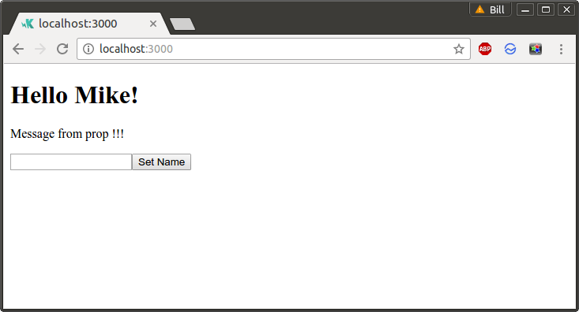
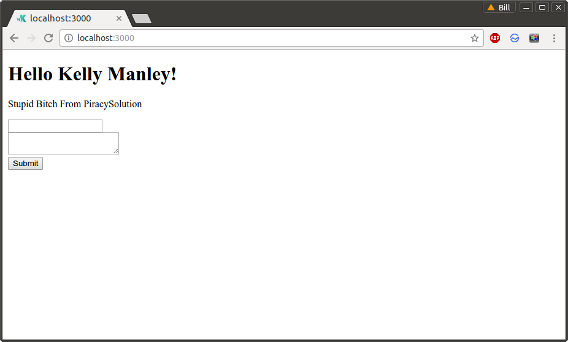

# [Udemy] The Complete React Web App Developer Course [2016, ENG]

 

I'm working on Ubuntu 14.04 in docker container with debian jessie:

    $ lsb_release -a
    Distributor ID:	Ubuntu
    Description:	Ubuntu 14.04.5 LTS
    Release:	14.04
    Codename:	trusty

 

    $ docker -v
    Docker version 1.12.3, build 6b644ec

 

<ul>
    <li><a href="http://sysadm.info/linux/containers/docker/installation/ubuntu/">How to install docker on Ubuntu 12 / 14 / 16</a></li>
    <li><a href="http://jsdev.org/env/docker/run-container/">How to run docker container to start development</a></li>
</ul>

 

    # node -v
    v7.3.0

 

    # npm -v
    3.10.10

 

### 03 Hello React

**006 Creating Your Web Server**

    # mkdir 03_Hello_React
    # cd 03_Hello_React/

    # npm init
    # npm install -g nodemon
    # npm install --save express@4

    # nodemon server.js

    http://localhost:3000/

**007 Hello React**

**008 Atom Editor Plugins Optional**

    atom-beautify
    react

**009 Your First React Component**

**010 Learning JSX**

**011 Component Properties**

**012 User Events Callbacks**

**013 Component State**

 

**014 Nested Components Part 1**

**015 Nested Components Part 2**

**016 Aside Props State**

**017 Section Challenge**

 

### 04 A Better React Project

**018 What is Webpack And Installing It**

    # npm install -g webpack@1.12.13
    # npm install --save react@0.14.7
    # npm install --save react-dom@0.14.7

    # npm install --save-dev webpack@1.12.13
    # npm install --save-dev babel-core@6.5.1
    # npm install --save-dev babel-loader@6.2.2
    # npm install --save-dev babel-preset-es2015@6.5.0
    # npm install --save-dev babel-preset-react@6.5.0

**019 Generating Our Bundle**

    # webpack ./public/app.js ./public/bundle.js

http://localhost:3000/

**020 The Webpack Config File**

    # webpack

**021 Adding Babel JSX Support**

    # webpack

  

___

**Marley**

<a href="https://labs.jsdev.org">labs.jsdev.org</a>

email:  

